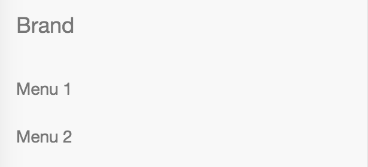
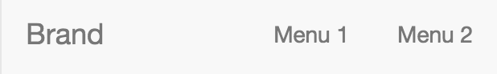

# bootstrap-inline-nav-xs

Import `inline-nav-xs.less` into your LESS file if you don't want collapse your
navs in the navbar into multiple lines in xs viewport.

Go from this:



to this:



```
// in your LESS file

@import "../node_modules/bootstrap/less/bootstrap";
@import "../node_modules/bootstrap-inline-nav-xs/inline-nav-xs";
```
